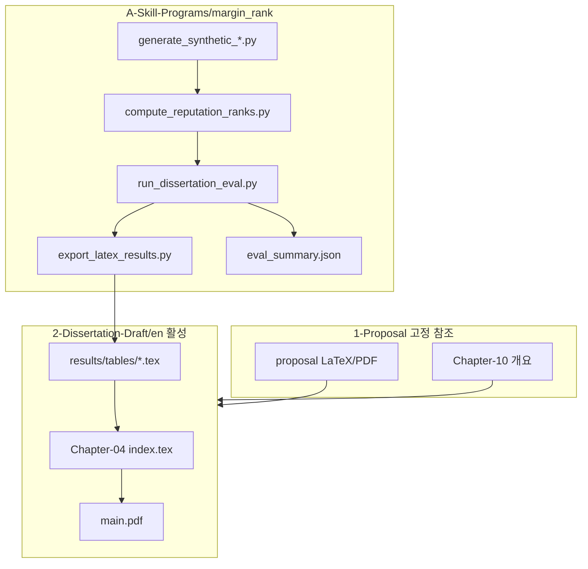

# phd_works — EndorseRank 박사 연구

**EndorseRank**에 관한 박사 연구: Arbitrum One에서 Adaptive Weighted PageRank를 이용한 온체인 평판 순위, GMX V2 거래 성공 프록시와의 검증.

이 저장소에는 **완료된 논문 제안서**(고정 참조), **작업 중인 논문 초안**(6장 LaTeX), **실증 평가 코드**, 공유 참고 논문이 포함되어 있습니다.

**기여자 및 AI 에이전트를 위한 원칙:** `2-Dissertation-Draft/`와 `A-Skill-Programs/`를 편집하고, 제안서를 명시적으로 변경하라는 요청이 없는 한 `1-Proposal/`은 읽기 전용 기준선으로 취급합니다.

---

## 개발 현황

저장소의 진화 과정과 현재 활성 영역:

| 단계 | 상태 | 위치 |
|------|------|------|
| 논문 제안서 | **완료 · 고정** | `1-Proposal/proposal/` |
| 저장소 재구조화 (`phd_works`) | 완료 | `1-Proposal/`, `2-Dissertation-Draft/`, `A-Skill-Programs/` |
| 논문 초안 (6장) | **활성** | `2-Dissertation-Draft/en/` (영문), `2-Dissertation-Draft/kr/` (한국어) |
| 실증 파이프라인 | **활성 (실데이터 + 오프라인)** | `A-Skill-Programs/margin_rank/` — BQ 추출 완료, 6-family·7-method eval |
| BigQuery 실데이터 추출 | **완료 (Tier 1, n=5,521)** | GMX 6mo + reputation + Aave lending; `run_dissertation_eval.py --real` |

논문 초안 4–5장은 **BigQuery 실측 mean τ**를 반영한다. EndorseRank·AWP·GF-PR 3-method 표는 [`results/tables/`](2-Dissertation-Draft/en/results/tables/)에서 재생성; 확장 baseline은 [`archive/extended-baselines/`](2-Dissertation-Draft/en/archive/extended-baselines/README.md). 연구 진행 narrative: [`.cursor/journey.md`](.cursor/journey.md).

---

## 연구 주장

논문은 다섯 가지 실증 주장을 뒷받침해야 합니다. 각 주장이 LaTeX와 코드에서 어디에 있는지 아래 표를 참고하세요.

| # | 주장 | 가설 / 초점 | 논문 | 코드 / 출력 |
|---|------|-------------|------|-------------|
| 1 | EndorseRank가 동일 지갑 샘플에서 AWP보다 **빠르다** | H3 (효율) | Ch4–5, [`results/tables/benchmark-runtime.tex`](2-Dissertation-Draft/en/results/tables/benchmark-runtime.tex) | `benchmark_runtime.py` |
| 2 | **Spearman ρ / Kendall τ**로 EndorseRank의 신뢰성 입증; GMX 정렬에서 AWP보다 우수 | H2 (정렬) | Ch4, `alignment-transfer.tex`, `alignment-gmx.tex` | `evaluate_alignment.py` — **실측: AWP가 대부분 family 우세, ER는 allowance만 우세** (see central journey log) |
| 3 | 검증이 transfer 프록시(in-degree/in-value)에서 **GMX margin** 프록시로 바뀌면 AWP **τ가 개선**된다 | 도메인 프레임 | Ch4–5, [`alignment-summary.tex`](2-Dissertation-Draft/en/results/tables/alignment-summary.tex) | `eval_summary.json`의 cross-proxy mean τ |
| 4 | EndorseRank가 transfer + GMX **양쪽** 프록시 계열에서 AWP보다 mean τ가 높다 | H2 확장 | Ch4–5 요약 표 | **실측 미달** — trade-off 서술로 전환 |
| 5 | 결론은 주장 1–4에서 도출된다 | — | Ch6 | — |

**프록시 계열** (Do et al. 2023 + 제안서 Ch5):

- **Transfer (AWP 논문 기준선):** in-degree, in-value (유입 ERC-20 transfer).
- **GMX margin:** close-success count, realized gain proxy, close success rate (최소 3회 close).

---

## 아키텍처 — LaTeX와 코드



**핵심 규칙:** 4장 표의 수치를 **수동으로 편집하지 마세요.** 아래 파이프라인으로 재생성합니다:

`run_dissertation_eval.py` → `export_latex_results.py` → [`Chapter-04 index.tex`](2-Dissertation-Draft/en/Chapter-04-Implementation-and-Empirical-Results/index.tex)의 `\input{results/tables/...}`

---

## 폴더 구조

| 경로 | 역할 |
|------|------|
| `1-Proposal/` | 완료된 제안서 (정본 LaTeX: `1-Proposal/proposal/`) |
| `proposal-ko/` | 제안서 한국어 LaTeX 번역본 (`build.ps1` → `main.pdf`) |
| `2-Dissertation-Draft/en/` | **활성** 영문 논문 초안 (정본) |
| `2-Dissertation-Draft/kr/` | 한국어 논문 초안 (표·그림은 `../en/` 재사용) |
| `2-Dissertation-Draft/sources/supervisor-feedback/` | 지도교수 초안 리뷰 (DOCX·이메일·코멘트 전사) |
| `5-Roundtable/` | Roundtable·진전 발표 (일자별 `pptx` / `html`) |
| `A-Skill-Programs/` | 실증 코드 (`margin_rank/`) |
| `papers/` | 공유 참고 PDF |

### `1-Proposal/` 내부

| 경로 | 역할 |
|------|------|
| `1-Proposal/proposal/` | 승인된 제안서 LaTeX |
| `1-Proposal/sources/professor-feedback/` | 교수 코멘트 DOCX (읽기 전용) |
| `1-Proposal/archive/` | DOCX 도구, 스냅샷 |
| `1-Proposal/scripts/` | DOCX 병합 유틸리티 |

### `5-Roundtable/` 내부

| 경로 | 역할 |
|------|------|
| `5-Roundtable/YYYY-MM-DD/` | 해당 회차 발표 자료 (`index.html` 및/또는 `.pptx`) |
| `5-Roundtable/README.md` | 일자 폴더 규칙 |

### `2-Dissertation-Draft/sources/` 내부

| 경로 | 역할 |
|------|------|
| `supervisor-feedback/` | 2026-08 Moulla·Attipoe Word 리뷰와 Mnkandla 표지 이메일 |

### `2-Dissertation-Draft/en/` 내부

| 경로 | 역할 |
|------|------|
| `Chapter-01-…/index.tex` … `Chapter-06-…/index.tex` | 논문 6개 장 |
| `results/tables/*.tex` | **생성된** LaTeX 표 조각 (eval 파이프라인 출력) |
| `Config/preamble.tex` | Report 클래스, 폰트, `booktabs`, `siunitx` |
| `build.ps1` | XeLaTeX full + per-chapter PDF 빌드 |

한국어본은 `2-Dissertation-Draft/kr/`에 동일 구조를 두고, 표·생성 그림은 `../en/`을 참조합니다.

### `A-Skill-Programs/margin_rank/scripts/`

| 스크립트 | 역할 |
|----------|------|
| `generate_synthetic_rankings.py` | 오프라인 GMX 유사 close 이벤트 → `wallet_rankings.parquet` |
| `generate_synthetic_reputation.py` | 오프라인 approvals/transfers → 전처리 → 순위 |
| `extract_margin_week.py` | BigQuery GMX EventEmitter 로그 (**GCP**) |
| `extract_reputation_data.py` | BigQuery ERC-20 approvals/transfers (**GCP**) |
| `decode_gmx_events.py` | `PositionDecrease` 이벤트 디코딩 |
| `preprocess_arbitrum_allowances.py` | 최신 allowances parquet |
| `preprocess_arbitrum_transfers.py` | Transfer 이벤트 parquet |
| `compute_rankings.py` | GMX success-rate 순위 |
| `compute_reputation_ranks.py` | EndorseRank + AWP 점수 |
| `pagerank.py` | Weighted PageRank, AWP edge builder |
| `proxy_metrics.py` | 지갑별 in-degree, in-value, GMX 프록시 |
| `evaluate_alignment.py` | 프록시 대비 Spearman ρ, Kendall τ |
| `benchmark_runtime.py` | 실행 시간, 메모리, 반복 횟수 |
| `run_dissertation_eval.py` | **마스터** 오프라인/실데이터 eval → JSON |
| `export_latex_results.py` | JSON → `2-Dissertation-Draft/en/results/tables/*.tex` |

SQL 템플릿: `A-Skill-Programs/margin_rank/sql/`. 설정: `config/margin_config.yaml`.

---

## 워크플로

### A. 논문 본문만 편집

1. `1-Proposal/proposal/02-Content/`에서 해당 섹션을 읽습니다.
2. `2-Dissertation-Draft/en/Chapter-*/index.tex`만 편집합니다 (한국어는 `kr/`).
3. 빌드: `cd 2-Dissertation-Draft/en && ./build.ps1`

### B. 실증 표 갱신 (합성 — 현재 기본값)

```bash
cd A-Skill-Programs/margin_rank
python3 -m venv .venv && source .venv/bin/activate
pip install -r requirements.txt
python scripts/run_dissertation_eval.py --fixtures --n-wallets 571 --export-latex
cd ../../2-Dissertation-Draft/en && ./build.ps1
```

출력:

- `A-Skill-Programs/margin_rank/data/processed/eval_summary.json`
- `2-Dissertation-Draft/en/results/tables/*.tex`

### C. 실제 BigQuery 데이터로 전환 (향후)

1. [`A-Skill-Programs/margin_rank/README.md`](A-Skill-Programs/margin_rank/README.md)의 추출 단계를 따릅니다.
2. `python scripts/run_dissertation_eval.py --real --export-latex`
3. 논문 PDF를 다시 빌드하고, Ch4, Abstract, Discussion의 `% DUMMY` 주석을 검토·제거합니다.

### D. 제안서 변경 (드묾)

교수 피드백과 제안서 편집은 `1-Proposal/proposal/`에 유지합니다. 제안서 편집을 `2-Dissertation-Draft/`에 섞지 마세요.

---

## DUMMY 데이터 정책

| 항목 | 정책 |
|------|------|
| `.tex`의 `% DUMMY DATA` | BigQuery로 교체 가능한 내용 표시; 실제 파이프라인 실행 후에만 제거 |
| `data/processed/`, `data/raw/` | 로컬 전용 (`.gitignore`); 스크립트로 재생성 |
| `results/tables/*.tex` | `export_latex_results.py`로 생성; export 후 커밋 가능 |
| 커밋 | LaTeX 소스, 스크립트, export된 표 — `.venv/`, raw parquet는 제외 |

---

## AI 에이전트 가이드

### 참조 경로 (초안 편집 전에 읽기)

| 참조 | 경로 |
|------|------|
| 정본 제안서 LaTeX | `1-Proposal/proposal/` |
| 빌드된 제안서 PDF | `1-Proposal/proposal/main.pdf` |
| 교수 코멘트 (읽기 전용) | `1-Proposal/sources/professor-feedback/dissertation-proposal-commented.docx` |
| 연구 기준선 스냅샷 | `1-Proposal/archive/snapshots/proposal-0-research-baseline/` |
| 논문 6장 개요 | `1-Proposal/proposal/02-Content/Chapter-10.tex` |
| 실증 도구 | `A-Skill-Programs/margin_rank/` |
| 공유 PDF | `papers/` |

### 제안서 → 논문 장 매핑

| 논문 장 | 주요 제안서 출처 |
|---------|------------------|
| Ch 1 서론 | `Chapter-01`, `Chapter-02`, `Chapter-03` |
| Ch 2 문헌 검토 | `Chapter-02`, `Chapter-04` |
| Ch 3 방법론 | `Chapter-05`–`Chapter-07` |
| Ch 4 구현 및 결과 | `Chapter-08`, `A-Skill-Programs/margin_rank/` |
| Ch 5 논의 | `Chapter-08`, `Chapter-09` |
| Ch 6 결론 | `Chapter-09`, `Chapter-10` 개요 |

### 해야 할 것 (DO)

- 제안서와 용어를 맞출 것: EndorseRank, AWP, in-degree, in-value, GMX proxies.
- 4장 **수치**는 eval 파이프라인 재실행(워크플로 B)으로만 변경.
- 논문 본문은 **영어**로 유지; README는 한국어 가능.
- 커밋 시 `/git-commit` 스킬(또는 명시적 커밋 요청) 사용; 저장소 커밋 메시지 스타일 준수.

### 하지 말 것 (DON'T)

- `results/tables/`나 4장에 임의 표 수치를 기억에 의존해 붙여넣기.
- 6장 구조에 맞게 조정하지 않고 제안서 전체를 초안에 복사.
- 실제 BigQuery 데이터가 준비되기 전 `% DUMMY` 마커 제거.
- `1-Proposal/` 재구조화 또는 초안 파일을 저장소 루트로 되돌리기.
- export가 깨지지 않은 한 `export_latex_results.py` 출력을 수동 편집.

---

## 빌드

**제안서 (완료):**

```powershell
cd 1-Proposal/proposal
.\build.ps1
```

출력: `1-Proposal/proposal/main.pdf`

출력: `1-Proposal/proposal/main.pdf`

한국어 LaTeX:

```powershell
cd proposal-ko
.\build.ps1
```

출력: `proposal-ko/main.pdf` (본문 한국어; References는 영문 APA 유지)

Word export (PDF 레이아웃 유지):

```powershell
cd 1-Proposal/proposal
.\build-docx.ps1
```

출력: `1-Proposal/proposal/main.docx` (pdf2docx from `main.pdf` — Times New Roman, A4, margins, line breaks, figures)

**논문 초안 (활성):**

```powershell
cd 2-Dissertation-Draft/en
.\build.ps1
# 한국어본
cd ../kr
.\build.ps1
```

출력: `2-Dissertation-Draft/en/main.pdf`, `2-Dissertation-Draft/kr/main.pdf`

XeLaTeX 필요 (`fontspec`으로 Times New Roman; 한국어본은 Malgun Gothic).

---

## 관련 문서

- [`2-Dissertation-Draft/en/results/README.md`](2-Dissertation-Draft/en/results/README.md) — 결과 표 재생성
- [`A-Skill-Programs/margin_rank/README.md`](A-Skill-Programs/margin_rank/README.md) — CLI 상세, BigQuery 추출

## Git remote

```
origin  https://github.com/abitocodes/phd_works.git
```
