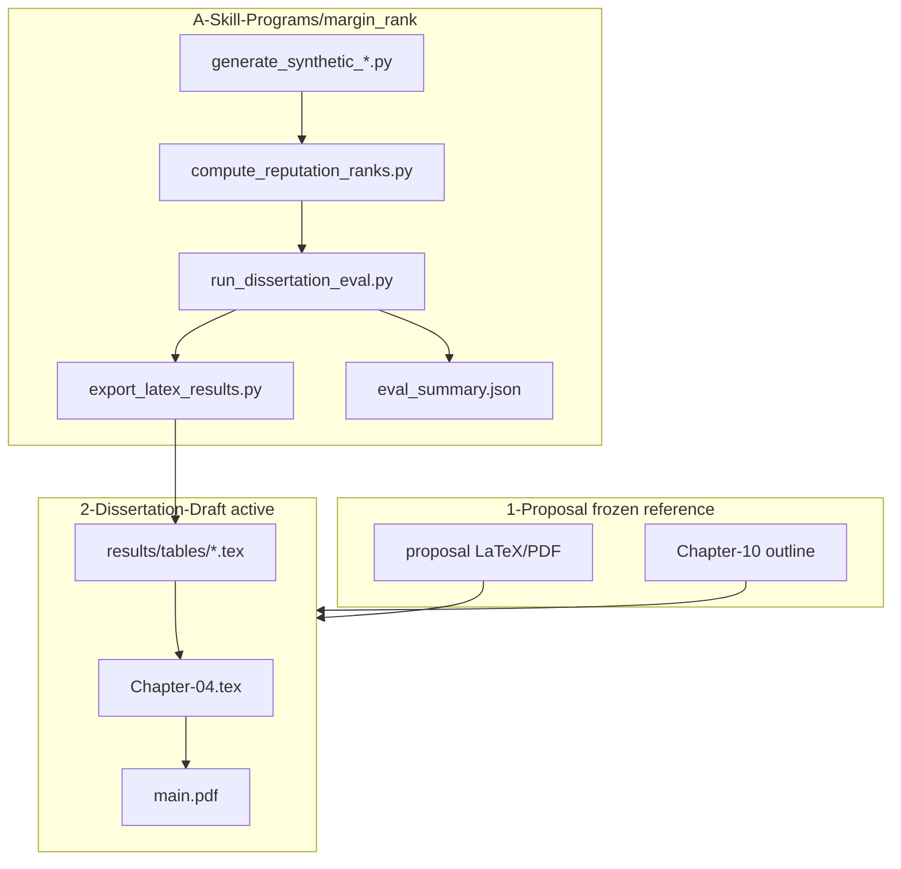

# phd_works — EndorseRank PhD Research

PhD research on **EndorseRank**: on-chain reputation ranking via Adaptive Weighted PageRank on Arbitrum One, validated against GMX V2 trading-success proxies.

This repository holds the **completed dissertation proposal** (frozen reference), the **active dissertation draft** (6-chapter LaTeX), **empirical evaluation code**, and shared reference papers.

**Rule of thumb for contributors and AI agents:** edit `2-Dissertation-Draft/` and `A-Skill-Programs/`; treat `1-Proposal/` as read-only baseline unless explicitly asked to change the proposal.

---

## Development status

How this repo evolved and what is active today:

| Phase | Status | Location |
|-------|--------|----------|
| Dissertation proposal | **Complete · frozen** | `1-Proposal/proposal/` |
| Repo restructure (`phd_works`) | Done | `1-Proposal/`, `2-Dissertation-Draft/`, `A-Skill-Programs/` |
| Dissertation draft (6 chapters) | **Active** | `2-Dissertation-Draft/` — Ch1–6 LaTeX + `\input` result tables |
| Empirical pipeline | **Active (offline)** | `A-Skill-Programs/margin_rank/` — synthetic fixtures, no GCP |
| BigQuery real extraction | **Not yet run** | `extract_*.py` ready; requires ADC + `GOOGLE_CLOUD_PROJECT` |

The dissertation draft currently reports **synthetic dummy numbers** in Chapter 4. Every numeric table and `% DUMMY` comment marks data that must be replaced after BigQuery extraction.

---

## Research claims

The dissertation must support five empirical claims. Use this table to find where each claim lives in LaTeX and code.

| # | Claim | Hypothesis / focus | Dissertation | Code / output |
|---|-------|-------------------|--------------|---------------|
| 1 | EndorseRank is **faster** than AWP on the same wallet sample | H3 (efficiency) | Ch4–5, [`results/tables/benchmark-runtime.tex`](2-Dissertation-Draft/results/tables/benchmark-runtime.tex) | `benchmark_runtime.py` |
| 2 | **Spearman ρ / Kendall τ** show EndorseRank is credible; higher GMX alignment than AWP | H2 (alignment) | Ch4, `alignment-transfer.tex`, `alignment-gmx.tex` | `evaluate_alignment.py` |
| 3 | AWP **τ improves** when validation shifts from transfer proxies (in-degree/in-value) to **GMX margin** proxies | Domain frame | Ch4–5, [`alignment-summary.tex`](2-Dissertation-Draft/results/tables/alignment-summary.tex) | cross-proxy mean τ in `eval_summary.json` |
| 4 | EndorseRank beats AWP on mean τ under **both** proxy families (transfer + GMX) | H2 extended | Ch4–5 summary table | same as #3 |
| 5 | Conclusions follow from Claims 1–4 | — | Ch6 | — |

**Proxy families** (from Do et al. 2023 + proposal Ch5):

- **Transfer (AWP paper baseline):** in-degree, in-value (inbound ERC-20 transfers).
- **GMX margin:** close-success count, realized gain proxy, close success rate (min 3 closes).

---

## Architecture — LaTeX and code



**Critical rule:** do **not** hand-edit numbers in Chapter 4 tables. Regenerate via:

`run_dissertation_eval.py` → `export_latex_results.py` → `\input{results/tables/...}` in [`Chapter-04.tex`](2-Dissertation-Draft/02-Content/Chapter-04.tex).

---

## Folder layout

| Path | Role |
|------|------|
| `1-Proposal/` | Completed proposal (canonical LaTeX: `1-Proposal/proposal/`) |
| `2-Dissertation-Draft/` | **Active** dissertation draft (6-chapter thesis) |
| `A-Skill-Programs/` | Empirical code (`margin_rank/`) |
| `papers/` | Shared reference PDFs |

### Inside `1-Proposal/`

| Path | Role |
|------|------|
| `1-Proposal/proposal/` | Approved proposal LaTeX |
| `1-Proposal/sources/professor-feedback/` | Professor-commented DOCX (read-only) |
| `1-Proposal/archive/` | DOCX tools, snapshots |
| `1-Proposal/presentations/` | Talks and slides |
| `1-Proposal/scripts/` | DOCX merge utilities |

### Inside `2-Dissertation-Draft/`

| Path | Role |
|------|------|
| `02-Content/Chapter-01.tex` … `Chapter-06.tex` | Six dissertation chapters |
| `results/tables/*.tex` | **Generated** LaTeX table fragments (from eval pipeline) |
| `Config/preamble.tex` | Report class, fonts, `booktabs`, `siunitx` |
| `build.ps1` | XeLaTeX two-pass build |

### `A-Skill-Programs/margin_rank/scripts/`

| Script | Role |
|--------|------|
| `generate_synthetic_rankings.py` | Offline GMX-like close events → `wallet_rankings.parquet` |
| `generate_synthetic_reputation.py` | Offline approvals/transfers → preprocess → ranks |
| `extract_margin_week.py` | BigQuery GMX EventEmitter logs (**GCP**) |
| `extract_reputation_data.py` | BigQuery ERC-20 approvals/transfers (**GCP**) |
| `decode_gmx_events.py` | Decode `PositionDecrease` events |
| `preprocess_arbitrum_allowances.py` | Latest allowances parquet |
| `preprocess_arbitrum_transfers.py` | Transfer events parquet |
| `compute_rankings.py` | GMX success-rate rankings |
| `compute_reputation_ranks.py` | EndorseRank + AWP scores |
| `pagerank.py` | Weighted PageRank, AWP edge builders |
| `proxy_metrics.py` | in-degree, in-value, GMX proxies per wallet |
| `evaluate_alignment.py` | Spearman ρ, Kendall τ vs proxies |
| `benchmark_runtime.py` | Runtime, memory, iterations |
| `run_dissertation_eval.py` | **Master** offline/real eval → JSON |
| `export_latex_results.py` | JSON → `2-Dissertation-Draft/results/tables/*.tex` |

SQL templates: `A-Skill-Programs/margin_rank/sql/`. Config: `config/margin_config.yaml`.

---

## Workflows

### A. Edit dissertation prose only

1. Read the matching section in `1-Proposal/proposal/02-Content/`.
2. Edit only `2-Dissertation-Draft/02-Content/Chapter-*.tex`.
3. Build: `cd 2-Dissertation-Draft && ./build.ps1`

### B. Refresh empirical tables (synthetic — current default)

```bash
cd A-Skill-Programs/margin_rank
python3 -m venv .venv && source .venv/bin/activate
pip install -r requirements.txt
python scripts/run_dissertation_eval.py --fixtures --n-wallets 571 --export-latex
cd ../../2-Dissertation-Draft && ./build.ps1
```

Outputs:

- `A-Skill-Programs/margin_rank/data/processed/eval_summary.json`
- `2-Dissertation-Draft/results/tables/*.tex`

### C. Switch to real BigQuery data (future)

1. Follow extract steps in [`A-Skill-Programs/margin_rank/README.md`](A-Skill-Programs/margin_rank/README.md).
2. `python scripts/run_dissertation_eval.py --real --export-latex`
3. Rebuild dissertation PDF; review and remove `% DUMMY` comments in Ch4, Abstract, Discussion.

### D. Proposal changes (rare)

Professor feedback and proposal edits stay in `1-Proposal/proposal/`. Do not mix proposal edits into `2-Dissertation-Draft/`.

---

## DUMMY data policy

| Item | Policy |
|------|--------|
| `% DUMMY DATA` in `.tex` | Marks BigQuery-replaceable content; remove only after real pipeline run |
| `data/processed/`, `data/raw/` | Local only (`.gitignore`); regenerate with scripts |
| `results/tables/*.tex` | Generated by `export_latex_results.py`; safe to commit after export |
| Commit | LaTeX sources, scripts, exported tables — not `.venv/`, not raw parquet |

---

## AI agent guide

### Reference paths (read before editing draft)

| Reference | Path |
|-----------|------|
| Canonical proposal LaTeX | `1-Proposal/proposal/` |
| Built proposal PDF | `1-Proposal/proposal/main.pdf` |
| Professor comments (read-only) | `1-Proposal/sources/professor-feedback/dissertation-proposal-commented.docx` |
| Research baseline snapshot | `1-Proposal/archive/snapshots/proposal-0-research-baseline/` |
| Dissertation 6-chapter outline | `1-Proposal/proposal/02-Content/Chapter-10.tex` |
| Empirical tooling | `A-Skill-Programs/margin_rank/` |
| Shared PDFs | `papers/` |

### Proposal → dissertation chapter mapping

| Dissertation chapter | Primary proposal sources |
|----------------------|--------------------------|
| Ch 1 Introduction | `Chapter-01`, `Chapter-02`, `Chapter-03` |
| Ch 2 Literature review | `Chapter-02`, `Chapter-04` |
| Ch 3 Methodology | `Chapter-05`–`Chapter-07` |
| Ch 4 Implementation & results | `Chapter-08`, `A-Skill-Programs/margin_rank/` |
| Ch 5 Discussion | `Chapter-08`, `Chapter-09` |
| Ch 6 Conclusion | `Chapter-09`, `Chapter-10` outline |

### DO

- Confirm terminology against the proposal: EndorseRank, AWP, in-degree, in-value, GMX proxies.
- Change Chapter 4 **numbers** only by re-running the eval pipeline (Workflow B).
- Keep dissertation body in **English**; README may be Korean.
- Use `/git-commit` skill (or explicit commit request) when committing; follow repo commit message style.

### DON'T

- Paste arbitrary table values into `results/tables/` or Chapter 4 from memory.
- Copy the full proposal into draft without adapting to the 6-chapter structure.
- Remove `% DUMMY` markers before real BigQuery data is in place.
- Restructure `1-Proposal/` or move draft files back to repo root.
- Edit `export_latex_results.py` output by hand unless export is broken.

---

## Build

**Proposal (completed):**

```powershell
cd 1-Proposal/proposal
.\build.ps1
```

Output: `1-Proposal/proposal/main.pdf`

**Dissertation draft (active):**

```powershell
cd 2-Dissertation-Draft
.\build.ps1
```

Output: `2-Dissertation-Draft/main.pdf`

Requires XeLaTeX (Times New Roman via `fontspec`).

---

## Related docs

- [`2-Dissertation-Draft/results/README.md`](2-Dissertation-Draft/results/README.md) — regenerating result tables
- [`A-Skill-Programs/margin_rank/README.md`](A-Skill-Programs/margin_rank/README.md) — CLI details, BigQuery extraction

## Git remote

```
origin  https://github.com/abitocodes/phd_works.git
```
